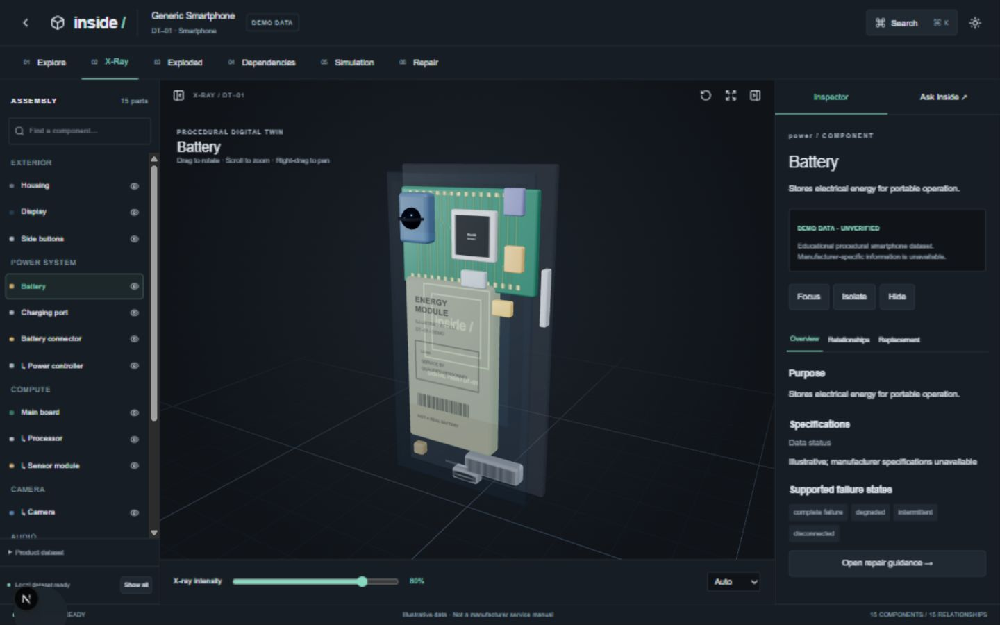
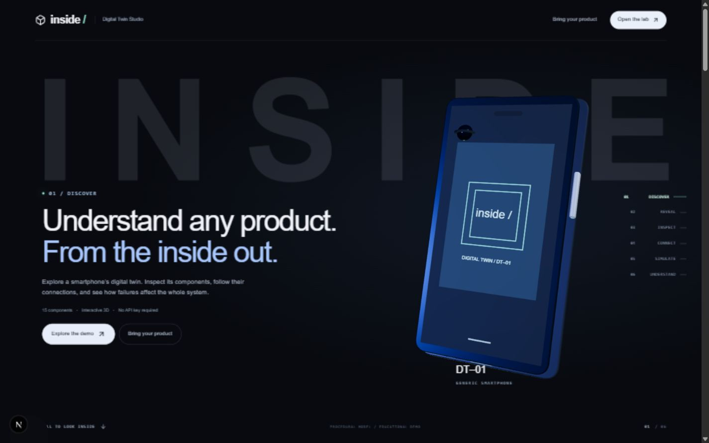

# OYNX — 3D Digital Twin Studio & Interactive Simulation Engine

[](https://nextjs.org/)
[](https://react.dev/)
[](https://threejs.org/)
[](https://www.typescriptlang.org/)
[](https://tailwindcss.com/)
[](https://vitest.dev/)

An advanced, interactive educational product twin and failure-simulation studio built with **Next.js (Turbopack)**, **React 19**, **Three.js**, **React Three Fiber (@react-three/fiber)**, **Drei**, and **Zustand**. 

Experience schematic educational internals paired with 3D exterior models, inspect deep component dependencies, run deterministic qualitative what-if failure simulations, and explore repair procedures—all running 100% locally in your browser with zero mandatory external API keys.

---

## ⚖️ Legal Notice & Trademark Disclaimers

> [!IMPORTANT]
> **Trademark Notice (Apple Inc.)**:  
> **Apple**, **iPhone**, and associated product names are registered trademarks of **Apple Inc.** in the U.S. and other countries.  
> This software (**OYNX / Inside**) is an **independent, open-source, non-commercial educational research project** created under **nominative fair use**. It is **NOT** sponsored, affiliated with, authorized, or endorsed by Apple Inc. in any manner.

> [!NOTE]
> **Educational & Non-Manufacturer CAD Notice**:  
> All internal component geometries, dependency graphs, specifications, failure modes, and repair steps depicted in this project are **conceptual educational demonstrations**. They do **not** represent official manufacturer engineering CAD, certified service manuals, or authorized repair protocols.

> [!TIP]
> **3D Model Attribution (CC BY 4.0)**:  
> The 3D exterior phone model is authored by **[MajdyModels](https://sketchfab.com/MG990)** and distributed under the **[Creative Commons Attribution 4.0 International License (CC BY 4.0)](https://creativecommons.org/licenses/by/4.0/)**. Adaptations made: web scale normalization, real-time material integration, and pairing with procedural educational internals.

---

## 📸 Preview Showcase

| Interactive 3D Digital Twin | Animated Hero & Exploration |
| :---: | :---: |
|  |  |

---

## 🚀 How to Run Locally from Terminal

Follow this quick guide to run the project locally on your machine.

### 📋 Local Execution Command Matrix

| Step | Action | Terminal Command | Directory | Description & Notes |
| :---: | :--- | :--- | :--- | :--- |
| **1** | **Navigate to Project** | `cd work/3D-twin` | Project Root | Move into the project directory where `package.json` resides. |
| **2** | **Install Dependencies** | `npm install` *(or `npm ci`)* | `work/3D-twin` | Installs Three.js, React Three Fiber, Next.js, and dependencies. |
| **3** | **Start Dev Server** | `npm run dev` | `work/3D-twin` | Launches the local server at `http://127.0.0.1:3000`. |
| **4** | **Open in Browser** | `http://127.0.0.1:3000` | Browser URL | Open your browser and click **"Try Interactive Demo"**. |
| **5** | **Run Type Check** | `npm run typecheck` | `work/3D-twin` | Validates TypeScript schemas, components, and types. |
| **6** | **Run Unit Tests** | `npm test` | `work/3D-twin` | Runs Vitest unit test suite (graph, model, engines). |
| **7** | **Production Build** | `npm run build` | `work/3D-twin` | Compiles optimized Next.js production bundle. |
| **8** | **Serve Production** | `npm run start` | `work/3D-twin` | Serves the production build locally at port 3000. |

> [!TIP]
> If you have opened the workspace root directory in your terminal (`files-pasted-by-the-user-you`), you can either run `cd work/3D-twin` first, or directly run `npm run dev` (proxied automatically via the root workspace configuration).

---

## 🛠️ Complete Terminal Scripts Reference

| NPM Script | Terminal Command | Purpose / Functionality |
| :--- | :--- | :--- |
| `dev` | `npm run dev` | Runs Next.js Turbopack dev server on `127.0.0.1:3000` |
| `build` | `npm run build` | Builds the production-ready Next.js application |
| `start` | `npm run start` | Starts the production server on `127.0.0.1:3000` |
| `typecheck` | `npm run typecheck` | Validates all TypeScript types with `tsc --noEmit` |
| `lint` | `npm run lint` | Runs ESLint 9 to verify code standards |
| `test` | `npm test` | Executes the Vitest unit test suite |
| `test:e2e` | `npm run test:e2e` | Runs Playwright end-to-end browser tests |
| `format` | `npm run format` | Auto-formats code with Prettier |

---

## 🌟 Key Features

- **🎮 High-Fidelity 3D Viewer & Controls**:
  - Smooth orbit, pan, zoom, camera reset, focus, component isolation, and fullscreen.
  - Interactive **X-Ray mode** with dynamic opacity slider.
  - **Exploded View Assembly**: Smoothly interpolate assembled and exploded positions for individual subsystems or the entire device.
  - Hardware GLTF/GLB rendering with robust procedural geometry fallback.

- **🔍 Component Inspector & Hierarchy**:
  - Synchronized bidirectional selection across 3D canvas, system tree, and inspector panel.
  - Inspect specifications, physical hierarchy, functional purpose, and materials for 15 internal components.

- **🕸️ Directed Dependency Graph**:
  - Provider-to-consumer directed graph with cycle detection (`battery → connector → power controller → logic board`).
  - Interactive nodes with pan, zoom, status highlighting, and bidirectional 3D focus links.

- **⚡ Deterministic Simulation Engine**:
  - Monotone finite fixed-point fault propagation: `healthy < degraded < failed`.
  - Simulate what-if scenarios (e.g., inject battery failure, thermal degradation, disconnect).
  - Compare baseline vs. degraded states with instant reset, undo, and multi-scenario session logging.

- **🔧 Grounded Repair & Compatibility Diagnostics**:
  - Structured step-by-step repair guides linked directly to 3D component focus.
  - Safety cautions, high-voltage warnings, and technical replacement criteria.
  - Explainable compatibility validation (`NOT_COMPATIBLE`, `POTENTIALLY_COMPATIBLE`, `VERIFIED_COMPATIBLE`).

- **🤖 Grounded Local Assistant**:
  - 100% local, privacy-preserving, and deterministic assistant.
  - Answers contextual questions strictly using current product state, graph relationships, and repair data.
  - No external paid API keys or remote LLMs required.

- **📦 Community Device Builder & JSON I/O**:
  - Create and test custom digital twins with schema validation.
  - Export product JSON definitions and import community models with live verification.
  - Interactive procedural automotive prototype teaser.

---

## 📁 Repository Structure

```text
3D-twin/
├── docs/
│   └── images/              # Project screenshots & visual assets
├── public/
│   └── models/              # 3D GLTF/GLB models (iPhone exterior under CC BY 4.0)
├── src/
│   ├── app/                 # Next.js App Router (pages, layout, globals.css)
│   ├── components/          # React components
│   │   ├── Viewer.tsx       # Three.js / React Three Fiber 3D Canvas
│   │   ├── Inspector.tsx    # Component detail inspector
│   │   ├── DependencyView.tsx # Graph visualization
│   │   ├── Assistant.tsx    # Grounded contextual assistant
│   │   ├── Intake.tsx       # Interactive landing & intake flow
│   │   ├── Workspace.tsx    # Studio layout orchestration
│   │   └── ui/              # Buttons, inputs, dialogs, sliders
│   ├── data/                # Product definitions (iPhone, demo systems)
│   └── lib/                 # Core engine logic
│       ├── graph.ts         # Dependency graph algorithms & cycles
│       ├── simulation.ts    # Monotone failure propagation
│       ├── product.ts       # Zod schemas & validator
│       ├── store.ts         # Zustand state management
│       └── model.ts         # Three.js material & GLTF mapping
├── ATTRIBUTION.md           # 3D model licenses and credit records
├── DISCLAIMER.md            # Comprehensive trademark and educational disclaimers
├── .gitignore               # Clean GitHub ignore rules
├── package.json             # Scripts & dependencies
└── tsconfig.json            # TypeScript configuration
```

---

## 🐙 Git & GitHub Upload Guide

This repository is optimized for Git and GitHub. All heavy build outputs, temporary caches, and system files are excluded via `.gitignore`.

### 1. Uploading / Pushing to GitHub

Open your terminal and run the following commands:

```bash
# 1. Ensure you are in the project folder
cd work/3D-twin

# 2. Check the current git status
git status

# 3. Stage changes
git add .

# 4. Commit your changes
git commit -m "feat: complete 3D digital twin studio and local terminal setup"

# 5. Push to GitHub
git push origin main
```

*(If you are pushing to a new repository, configure your remote first: `git remote add origin https://github.com/<your-username>/<your-repo-name>.git` followed by `git push -u origin main`)*

### 2. Git-Friendly Safeguards in place

- ✅ **`node_modules/` & `.next/`** build output ignored.
- ✅ **`*.tsbuildinfo` & `*.log`** cache ignored.
- ✅ **`.env*`** files protected (sample provided in `.env.example`).
- ✅ **Test results & coverage reports** ignored.
- ✅ **No unlicensed heavy assets** in repository.

---

## 🧪 Running Tests & Quality Checks

```bash
# Run Vitest unit tests
npm test

# Run TypeScript typecheck
npm run typecheck

# Run ESLint validation
npm run lint

# Run End-to-End Playwright tests
npm run test:e2e
```

---

## 📄 License & Credits

- The software framework, simulation engines, and procedural 3D models are open source under the **MIT License**.
- Bundled iPhone exterior 3D asset is credited under **CC BY 4.0** to [MajdyModels](https://sketchfab.com/MG990). See [`ATTRIBUTION.md`](./ATTRIBUTION.md) and [`DISCLAIMER.md`](./DISCLAIMER.md) for complete details.
